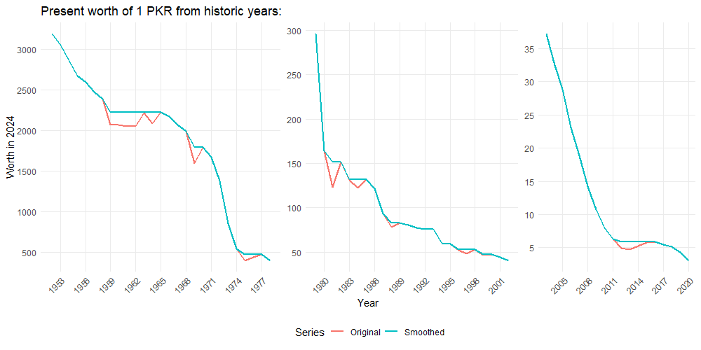

# PKR Historic to Present Value Converter (آج کے حساب سے)
This simple calculator estimates how much an amount of Pakistani Rupees from past would be worth in today's Pakistani Rupees in terms of equal purchasing power of Gold.

## Methodology
Conversions are based on historic Gold-prices in Pakistan.

`Present PKR Value = Historic PKR Amount * Current Gold Price / Historic Gold Price`

Data series for yearly average of local Gold-price published in [SBP Statistical Handbook 2020](https://www.sbp.org.pk/departments/stats/PakEconomy_Handbook/Chap-2.9.pdf) is used. To retain an increasing trend of gold price, the data series is monotonically smoothed by using forward-looking minimum values `P*(t)` of gold price, where: 

`P*(t) = Min[P(t),P(t+1),P(t+2),...,P(t+n)]`

Thus, the effect of fluctuations in gold price (observed notably in FY59-64 and FY12-15) has been removed with minimum loss of information from original data.  

